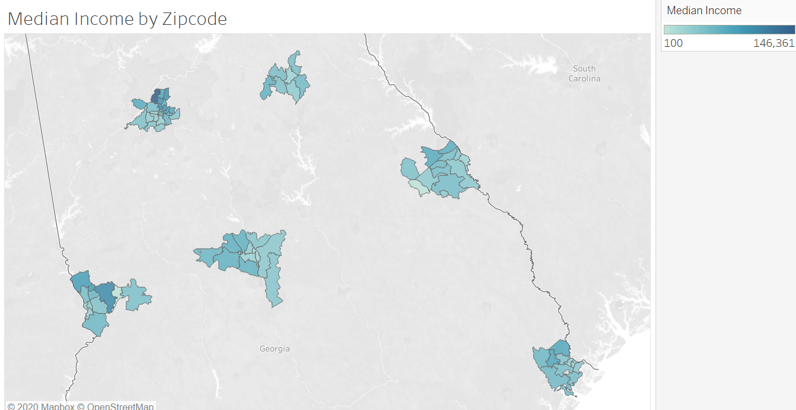
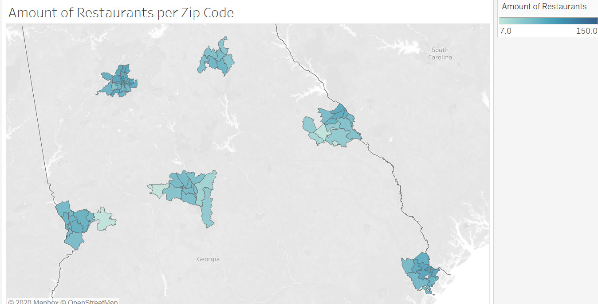

# Predicting Affluence of a Neighborhood with Yelp Data
## Problem Statement:
We will create a model that estimates the median income of a given zip code based on the price ranking of Yelp businesses within that neighborhood. This tool will expect to get, as an input, a list of zip codes for a given area and will estimate the wealth of the locality by aggregating the price rankings of every business in that zip code.
While traditional methods typically estimate wealth of a locality based on demographic characteristics (e.g. income or unemployment rate), the novelty of this approach is in its use of big data related to commercial activity and cost of product and services as an indicator for affluence.
TL;DR	Can we predict median household income based on yelp data?

## Introduction

In order to help predict the affluence of a neighborhood our group gathered data from the Yelp API and statisticalatlas.com. From the Yelp API we gathered the name and address of businesses in selected zip codes as well as the price information for each business (rated from $ to $$$$) and the type of business (e.g. Caribbean Restaurant or Dog Park). From Statistical Atlas we scraped the median income for each zip code using BeautifulSoup. The zip codes we used included every zip code from the 6 largest cities in Georgia: Atlanta, Athens, Augusta, Columbus, Macon, and Savannah. Nine of the initial zip codes presented problems due to page formatting and lack of income information. These issues are addressed in the stats_atlas_scrape notebook. The final list input into the model included 78 zip codes.

## Exploratory Data Analysis

After scraping our data from Yelp, we found that over half of our data ended up being duplicates. This was a problem we kept running into with the Yelp API because it was mostly set up for people who are trying to use Yelp data to create an app. However, this problem should not affect our model heavily because we are using the mean restaurant prices by zip code as the input of our model. When the values for each zip code are averaged this eliminates the problem of duplicates.

The Statistical Atlas website was fairly easy to scrap for the most part except for the fact that there were some web pages that were coded differently than others as well as some of the zip codes did not have information regarding a median income that we were trying to retrieve. To understand why this was an issue we researched the zip codes and found that some zip codes did not have residential areas within them. These areas are usually correlated with a major institution such as a college or hospital. These zip codes have been omitted from analysis as they do not have values for median income to predict.

Initially we started with only Atlanta zip codes, but then came to find that we wanted to collect more data to which our model would generalize.

We looked at the aggregate price of restaurants in each zip code and compared it to the median income for each zip code to see how these features aligned.

Median Income by Zipcode:
    
Number of Restaurants per Zip Code:

We also looked at each city to see which category of restaurants were in each city.

[Tableau Workbook](https://public.tableau.com/profile/julian.lafaye#!/vizhome/YelpandIncomeGeorgia/Sheet9?publish=yes)

## Modeling and Performance

We created Linear Regression to look for coefficient trends. After seeing trends, it was passed through a Lasso model to see if they were substantial enough to build a model off of. Lasso was the best performing on just Atlanta, and then to get a similar performance on all the data needed to be run through an XGBoost. The result was an R-squared of .33, which isn’t the best but better than 0. We tried SVR models and 8-layer Neural Nets model on all the data, but unfortunately this still didn’t work.

Conclusions

In general, the aggregate Yelp price data for each zip code is a poor predictor for the affluence / median income of a neighborhood. Our best model was only able to account for 33% of the variability in the data. This is not surprising as the price of a restaurant does not always reflect the type of neighborhood that that restaurant is in. In addition, the predictions of the model are often driven by the type of restaurant (such as barbecue) as opposed to price, suggesting that price has less to do with the model’s ability to predict median income. Our results suggest that the data available publicly through the Yelp API would not be the best resource for information about neighborhoods in the event of a major disaster.

## Future Ideas

We have several recommendations for future analysis and further research. First, we would like to evaluate how the size of each zip code in terms of square mileage affects the model. It is possible that some zip codes appear wealthier because they have a large number of nice restaurants but are actually just very large zip codes. Furthering this, we would like to explore the ratios per zip code of businesses at each price point. For example, a zip code may only have a small amount of restaurants in total, but if each of those restaurants is rated at $$$-$$$$ that zip code will likely still be a very wealthy area.

Additionally, we would like to examine how the model changes when we expand the zip codes that are included. We would like to do this both in terms of adding more zip codes to major cities (e.g. expanding Atlanta to the Atlanta Metropolitan area) and adding zip codes in other types of areas such as less populated suburbs. In Atlanta in particular there are several areas around the city limit that our group has patroned and that we would consider to be part of the Atlanta restaurant scene even though the addresses are not technically in the city limits of Atlanta. Doing this would give us more data to work with overall and might give us a better performing model.
